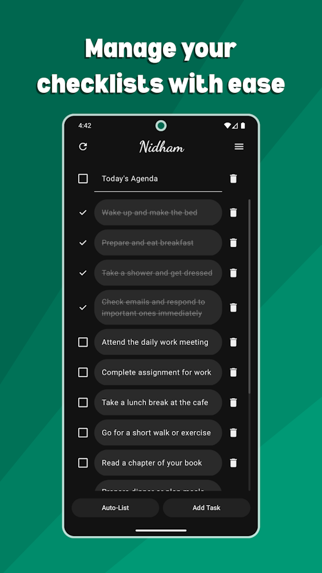
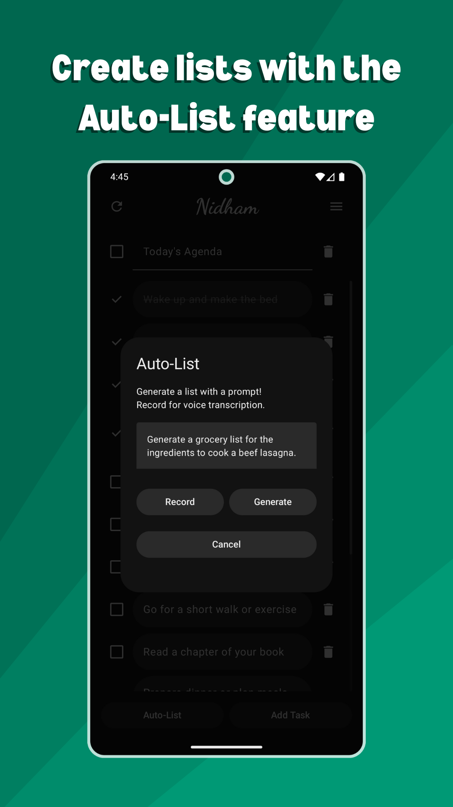
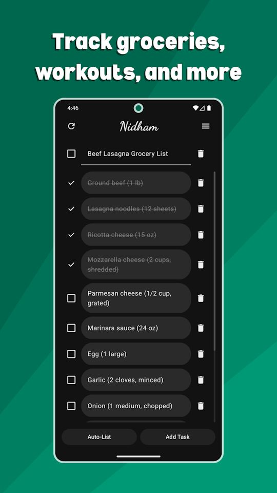
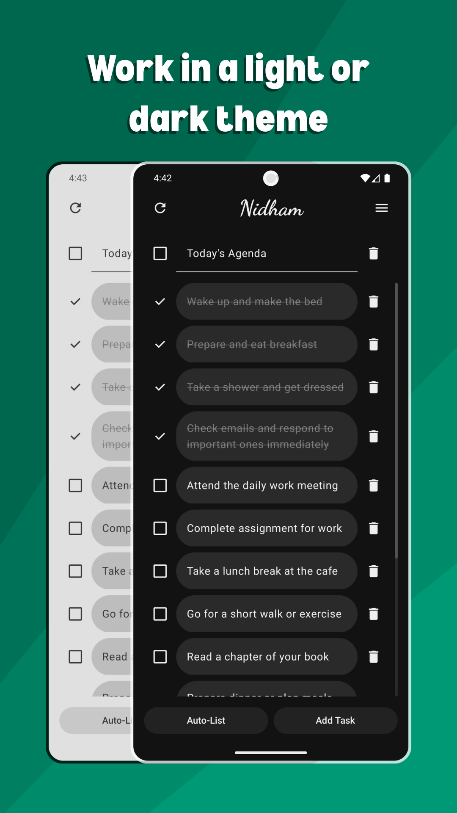
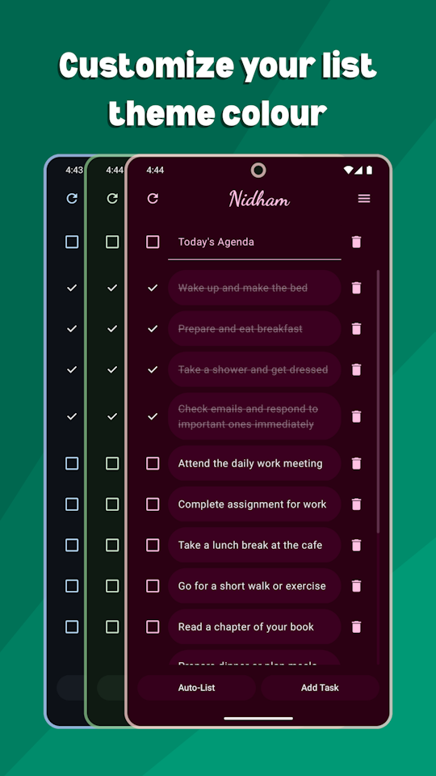

# Nidham - Checklist Manager

Nidham is a simple checklist management application for Android that helps users organize tasks, routines, and everyday planning. It is designed for people who want a clean, offline first checklist experience without accounts, distractions, or unnecessary complexity. The app also includes optional AI powered list generation for users who want to quickly create structured checklists with a prompt.

## Screenshots

<!-- App icon on its own line -->

<!-- Screenshots side by side -->

  
  
  
  
  

## Installation

Install Nidham through the Google Play store.

[Link to Play Store](https://play.google.com/store/apps/details?id=com.youzbaki.nidham)

## Features

- Automatic saving on every change
- Load last opened list on launch
- AI-powered checklist generation
- Light and dark mode support
- Color and layout customization

## Privacy and Data

This app does not collect or track any data from the users, all of the list data is stored locally on your device. The only data that leaves your device are the text prompts you write for the AutoList feature which get sent to the OpenAI API to generate lists. For more specific information on privacy and data, check out the privacy policy.

[Privacy Policy](https://www.yzbki.com/nidham-privacy-policy)

## FAQ

#### Why should I use this app over other list managers?

Nidham is unique because it provides a simple and dynamic user interface for checklist management. Most other list managers have too many unnecessary features and a cluttered user interface.

#### What is the utility of the AutoList feature?

The AutoList feature is incredibly useful for automatically generating lists based on a simple text prompt. You can use it to generate grocery lists, recipes, workouts, etc.

#### How does saving and loading work in this app?

Lists automatically save every change as long as they have a title and at least one non-empty task. In the future, I plan to add the ability to import and export lists so you can share them or have a backup.

#### How many lists and tasks can I create?

At the moment, you can save up to 10 lists with up to 100 tasks each.

## Authors

Mustafa Al-Youzbaki - [@yzbki](https://www.github.com/yzbki)

## License

This project is licensed under a custom license. See the LICENSE.md file for details.